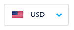

# tw-currency-select

> Currency select drop-down with flags

This plugin allows you to create a currency select dropdown on your page just by providing it with a list of currencies



Check a live example <a href="https://rawgit.com/transferwise/tw-currency-select/master/example/index.html" target="_blank">here</a>

The code of the example can be found [here](./example/index.html)

## Getting the plugin

The easiest way is to use bower
```
    bower install --save https://github.com/transferwise/tw-currency-select.git
```

## How to use

### Dependencies

1. `angular`
2. `jquery`
3. `bootstrap`
4. `bootstrap-select`

### Simple case

Add the script dependency
```html
    <script src="path-to/ng-scroll-repeat.js"></script>
```

Inject the directive into the required module
```js
    angular.module('myApp',['tw-currency-select']);
```

Use the html directive
```html
    <currency-select
        ng-model="selectedCurrency"
        currencies="currencies"
        ng-change="changedHandler()"></currency-select>
```

### Mapper & Extractor

Allows providing a `mapper` and an `extractor` to allow any object type in the currency list

Normally the currency-select component expects the currencies to have the following format

```js
    [{code: 'EUR'}, {code: 'GBP'}]
```

However by providing a mapper and an extractor as follows you can have a list of whatever type

```html
    <currency-select
        ng-model="selectedCurrencyCode"
        currencies="currencyCodes"
        mapper="codeMapper"
        extractor="codeExtractor"
        ng-change="changedCodeHandler()"></currency-select>
```

```js
$scope.currencyCodes = ['EUR', 'GBP'];

$scope.codeMapper = function(code) {
    return {code: code};
};

$scope.codeExtractor = function(currency) {
    return currency.code;
};
```

### ng-change

You can listen to change events and fire your own function using the `ng-change` attribute

### Hiding search

To hide search you can add the attribute `no-search="no-search"` to the directive element.

Example:
```html
    <currency-select
        ng-model="selectedCurrency"
        no-search="no-search"
        ng-change="changedHandler()"></currency-select>
```

### Customizing search-placeholder and no-results-text

You can customize the search-placeholder and no-results text by passing the attributes to the directive element.

Example:
```html
    <currency-select
        ng-model="selectedCurrency"
        search-placeholder="Search currency..."
        no-results-text="Ups! Nothing found for {0}"
        ng-change="changedHandler()"></currency-select>
```
